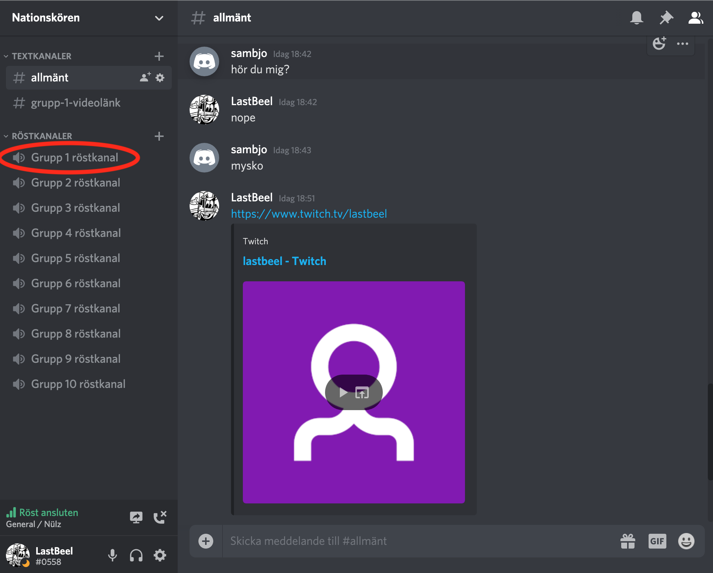
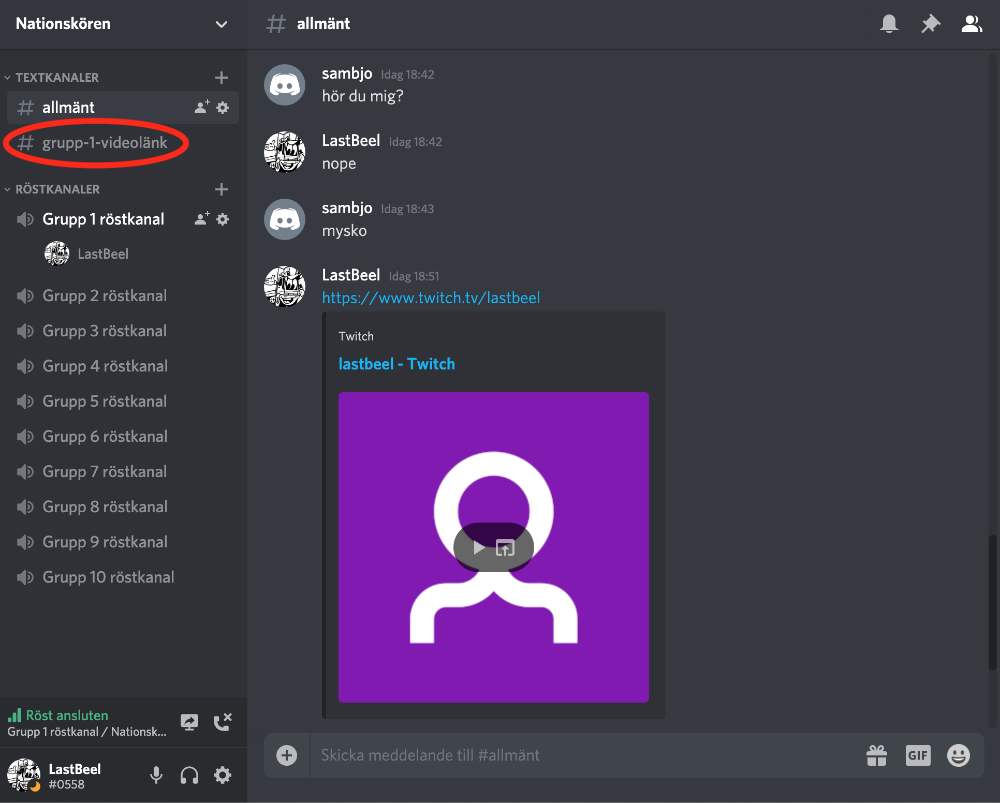
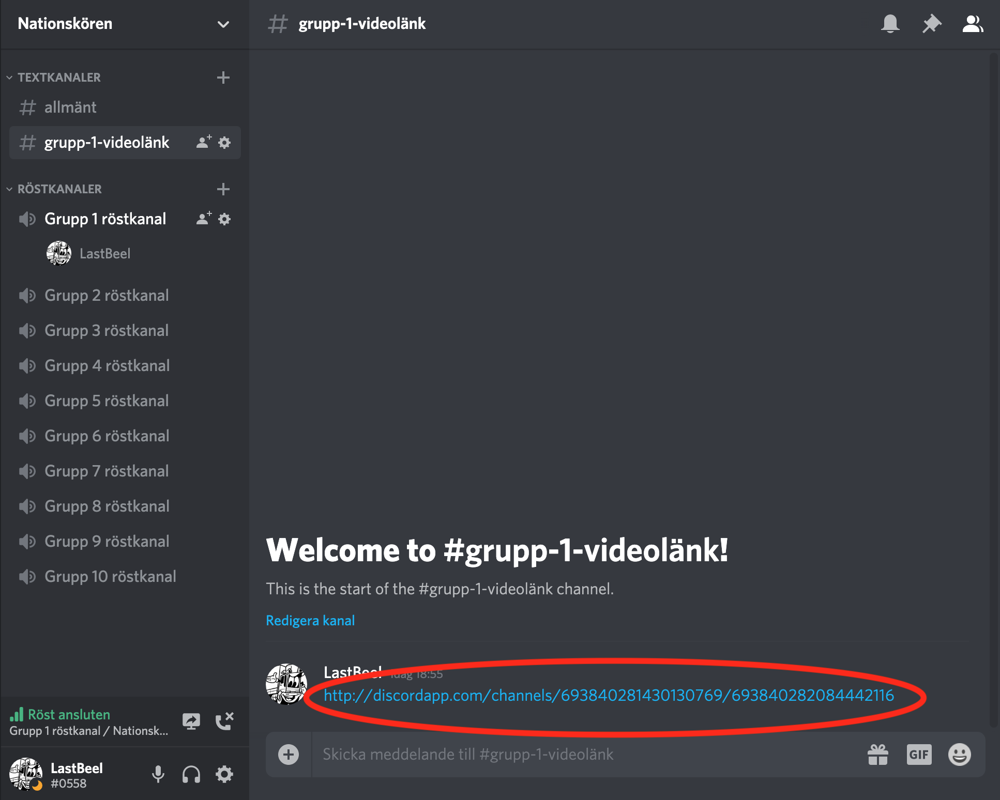
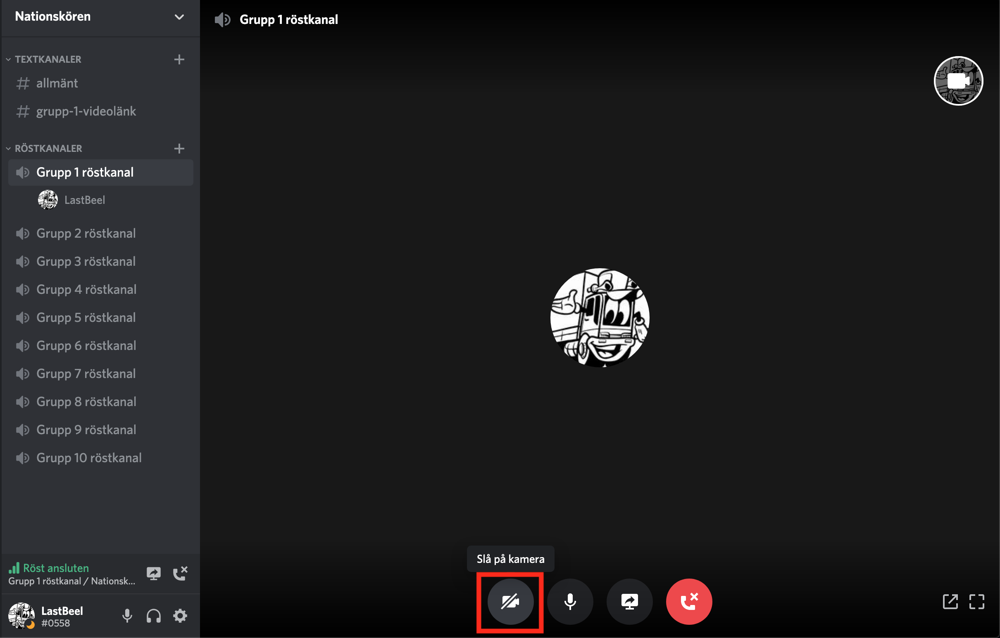
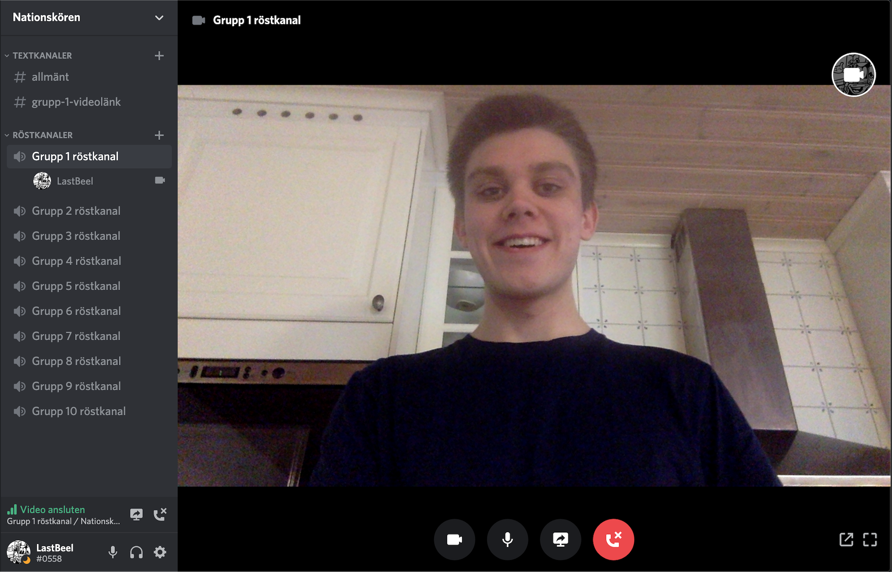
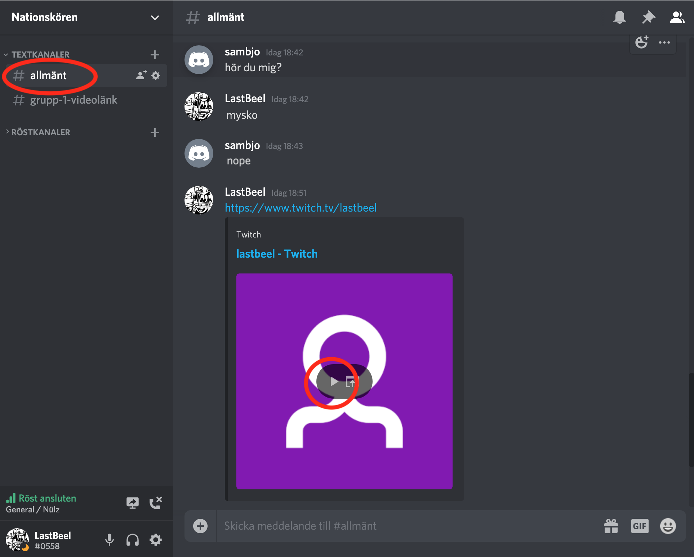

# Guide till Musik-quiz med Discord

## Steg 1

Fixa en laptop med kamera och mikrofon som funkar och stäng av alla energisugande program. Det funkar endast på dator, tyvärr ej på telefon.

## Steg 2

Ladda ned Discord om du inte har det redan och skapa en ny användare. <https://discordapp.com/download>

## Steg 3

Klicka på länken för att ansluta till Nationskörens Discord-grupp. <https://discord.gg/K3Cj7Bj>

## Steg 4:

När du är inne i gruppen kommer du se en massa kanaler.

Här följer några bilder som visar vad som du ska klicka på. Klicka där den röda ringen markerar och följ ordningen så ska det gå finfint.

Börja med att klicka in dig på den första röstkanalen: **Grupp 1 röstkanal** 

Klicka sedan på **grupp-1-videolänk** 

Klicka sedan på länken 

Slå på kameran 

:DD 

## Steg 5:

Nu kan du prata med folk så de kan hjälpa dig om det är oklarheter.

## Steg 6:

Klicka på **allmänt**, textkanalen högst upp.

Klicka sedan på play-knappen på länken. Musiken till musik-quizet kommer att spelas därifrån.

## Steg 7:

Du tilldelas ett gruppnummer och besöker din kanal enligt steg 4.

Frågorna till musik-quizet läggs ut på **allmänt**-textkanalen.
